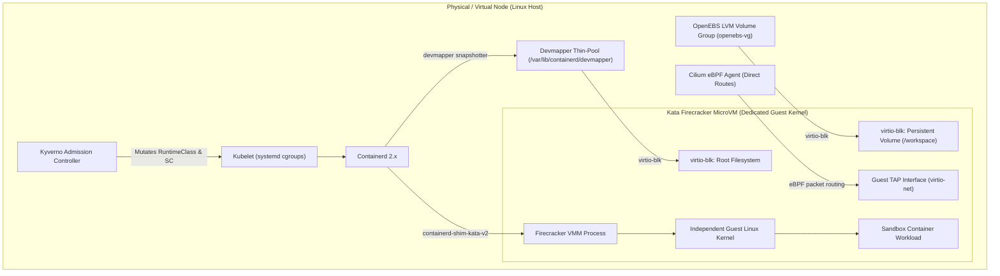
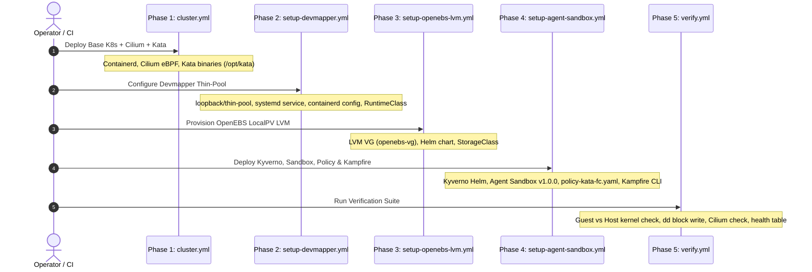

# Deploy Kubernetes Cluster with Kata Containers (Firecracker) & Cilium

This repository provides an automated, production-ready setup for deploying a Kubernetes cluster configured with **Kata Containers with Firecracker (`kata-fc`)** for hardware-isolated microVM pods, **Cilium** as the eBPF CNI, **OpenEBS LocalPV LVM** for raw block persistent storage, and **Kyverno** admission policies to automatically isolate **Kubernetes SIG Agent Sandboxes** managed via **Kampfire**.

---

## Table of Contents

- [Overview & Architecture](#overview--architecture)
- [Directory Contents](#directory-contents)
- [Architecture Deep Dives](#architecture-deep-dives)
  - [Storage: Firecracker vs Virtio-FS](#storage-firecracker-vs-virtio-fs)
  - [Networking: Cilium eBPF & MicroVM Isolation](#networking-cilium-ebpf--microvm-isolation)
- [What Each Stage Does (Deployment Lifecycle)](#what-each-stage-does-deployment-lifecycle)
  - [Stage 1: Base Kubernetes Cluster Deployment](#stage-1-base-kubernetes-cluster-deployment-cluster-clusteryml--varsyml)
  - [Stage 2: Devmapper Thin-Pool Setup for Firecracker](#stage-2-devmapper-thin-pool-setup-for-firecracker-devmapper-setup-devmapperyml)
  - [Stage 3: OpenEBS LocalPV LVM CSI Provisioning](#stage-3-openebs-localpv-lvm-csi-provisioning-openebs-setup-openebs-lvmyml)
  - [Stage 4: Kyverno Policy, Agent Sandbox & Kampfire](#stage-4-kyverno-policy-agent-sandbox--kampfire-sandbox-setup-agent-sandboxyml)
  - [Stage 5: Cluster & MicroVM Verification](#stage-5-cluster--microvm-verification-verify-verifyyml)
- [Prerequisites](#prerequisites)
- [Inventory Configuration](#inventory-configuration)
- [Deployment Guide](#deployment-guide)
  - [Option A: One-Click Docker Launcher (Recommended)](#option-a-one-click-docker-launcher-recommended)
  - [Option B: Running on Host Machine (Python / Ansible)](#option-b-running-on-host-machine-python--ansible)
- [Running Sandboxes with Kampfire](#running-sandboxes-with-kampfire)
- [Manual Kata-FC Pod Specification](#manual-kata-fc-pod-specification)
- [Standalone Verification & Diagnostics](#standalone-verification--diagnostics)

---

## Overview & Architecture

Running untrusted workloads (such as autonomous AI agents, code interpreters, and multi-tenant sandboxes) in standard container runtimes (runc) exposes the host Linux kernel to container breakout vulnerabilities. 

This stack solves isolation and performance constraints by integrating:
1. **Firecracker (`kata-fc`):** An open-source minimalist Virtual Machine Monitor (VMM) written in Rust. Each pod runs inside its own lightweight Linux microVM with dedicated kernel space, hardware virtualization (`/dev/kvm`), and minimal attack surface.
2. **Containerd Devmapper Snapshotter:** Provides direct block-device root filesystems for container images inside Firecracker.
3. **Cilium eBPF CNI:** Completely replaces `kube-proxy` with native eBPF routing and provides direct endpoint routing across Kata TAP network devices.
4. **OpenEBS LocalPV LVM CSI:** Allocates raw LVM logical volumes mapped over `virtio-blk` into microVMs for persistent storage.
5. **Kyverno & Agent Sandbox:** Enforces runtime mutation, storage classes, and network isolation policies transparently on sandboxed workloads.



---

## Directory Contents

| File | Description |
|------|-------------|
| [`docker-deploy.sh`](file:///Users/basarsubasi/kubespray/kata-fc-cilium/docker-deploy.sh) | **Automated deployment launcher** running inside the official Kubespray container. Supports running all phases or specific targeted stages. |
| [`inventory.ini`](file:///Users/basarsubasi/kubespray/kata-fc-cilium/inventory.ini) | Node inventory definition for control plane, etcd, and worker nodes, with per-node disk assignments (`openebs_lvm_device`). |
| [`vars.yml`](file:///Users/basarsubasi/kubespray/kata-fc-cilium/vars.yml) | Kubespray extra variables configuring containerd runtimes, Cilium eBPF, Kata static binaries, and devmapper snapshotter parameters. |
| [`setup-devmapper.yml`](file:///Users/basarsubasi/kubespray/kata-fc-cilium/setup-devmapper.yml) | Ansible playbook configuring persistent devmapper thin-pools, systemd units, containerd CRI snapshotter overrides, and the `kata-fc` `RuntimeClass`. |
| [`setup-openebs-lvm.yml`](file:///Users/basarsubasi/kubespray/kata-fc-cilium/setup-openebs-lvm.yml) | Ansible playbook configuring LVM volume groups (`openebs-vg`), loopback persistence / physical disk migration, and Helm deployment of OpenEBS LocalPV LVM CSI. |
| [`setup-agent-sandbox.yml`](file:///Users/basarsubasi/kubespray/kata-fc-cilium/setup-agent-sandbox.yml) | Ansible playbook deploying Kyverno, Kubernetes SIG Agent Sandbox controller v1.0.0, applying [`policy-kata-fc.yaml`](file:///Users/basarsubasi/kubespray/kata-fc-cilium/policy-kata-fc.yaml), installing Kampfire CLI, and verifying sandbox isolation. |
| [`policy-kata-fc.yaml`](file:///Users/basarsubasi/kubespray/kata-fc-cilium/policy-kata-fc.yaml) | Kyverno `ClusterPolicy` that intercepts Agent Sandbox pods and PVCs to mutate `runtimeClassName: kata-fc`, assign `storageClassName: openebs-lvm`, and auto-generate Cilium same-namespace isolation policies. |
| [`verify.yml`](file:///Users/basarsubasi/kubespray/kata-fc-cilium/verify.yml) | Ansible playbook verifying microVM guest kernel isolation, Cilium CNI routing, OpenEBS LVM raw block device attachment, and admission controller health. |

---

## Architecture Deep Dives

### Storage: Firecracker vs Virtio-FS

> [!IMPORTANT]
> **Why Devmapper and OpenEBS LocalPV LVM are Required for Firecracker:**
> Unlike QEMU and Cloud-Hypervisor, **Firecracker does NOT support `virtio-fs` or directory sharing (`overlayfs`)**. Firecracker can only mount storage inside the guest microVM via direct raw block devices (`virtio-blk`).
>
> 1. **Container Rootfs (Images):** Standard container engines mount image layers via `overlayfs`. Because Firecracker cannot mount host directories, Containerd must use the **`devmapper` snapshotter**. Devmapper formats image layers into thin-provisioned device-mapper block devices and passes them as block devices directly to Firecracker.
> 2. **Persistent Volumes (CSI):** Standard filesystem-based PVs (such as hostPath or NFS) fail because Firecracker cannot share host directory paths. Persistent volumes are handled by **OpenEBS LocalPV LVM**, which creates raw logical volumes and attaches them as `virtio-blk` devices with `volumeMode: Block`.

### Networking: Cilium eBPF & MicroVM Isolation

- **Kube-Proxy Replacement:** Standard `kube-proxy` iptables rules add significant latency and packet overhead. Cilium uses native eBPF programs attached to host interfaces and cgroups to direct traffic without iptables.
- **Endpoint Routes (`enable-endpoint-routes: "true"`):** When a Kata microVM boots, Kata creates a TAP device on the host. Cilium routes packets directly into the TAP interface via host-side endpoint routes.
- **Strict Namespace Network Confinement:** Kampfire sandboxes are automatically bound to an auto-generated `CiliumNetworkPolicy`. This policy restricts ingress and egress strictly to pods within the same namespace (preventing cross-tenant sandbox snooping), allows CoreDNS queries to `kube-system:53` and `nodelocaldns:53`, and permits outbound egress to the Internet (`world`).

---

## What Each Stage Does (Deployment Lifecycle)

The deployment is structured into **5 distinct phases**. Each phase is modular, idempotent, and can be executed independently or in sequence via [`docker-deploy.sh`](file:///Users/basarsubasi/kubespray/kata-fc-cilium/docker-deploy.sh).



---

### Stage 1: Base Kubernetes Cluster Deployment (`cluster` | `cluster.yml` + `vars.yml`)

- **Primary Tool:** Official Kubespray `cluster.yml` playbook
- **Target Hosts:** `kube_control_plane`, `etcd`, `kube_node`
- **Config Variables:** [`vars.yml`](file:///Users/basarsubasi/kubespray/kata-fc-cilium/vars.yml)

#### What This Stage Does:
1. **Installs Control Plane & Node Components:** Bootstraps etcd (on host), kube-apiserver, kube-scheduler, kube-controller-manager, and kubelet across target nodes.
2. **Deploys Cilium CNI with Native eBPF:**
   - Deploys Cilium CNI (`kube_network_plugin: cilium`).
   - Removes `kube-proxy` daemonsets (`kube_proxy_remove: true`) and enables Cilium's native eBPF kube-proxy replacement (`cilium_kube_proxy_replacement: true`).
   - Configures `cilium_operator_hostnetwork: true` to prevent IPAM deadlock during initial bootstrap.
   - Configures `enable-endpoint-routes: "true"` in the Cilium ConfigMap, allowing Cilium to cleanly route packets across the TAP virtual interfaces created for Kata microVMs.
3. **Installs Kata Containers Base Bundle:**
   - Sets `kata_containers_enabled: true`, which installs the static Kata Containers release into `/opt/kata/bin`.
   - Automatically loads required Linux kernel modules (`vhost_net`, `vhost_vsock`).
4. **Registers `kata-fc` in Containerd:**
   - Injects the `kata-fc` runtime handler into containerd configuration pointing to `/opt/kata/bin/containerd-shim-kata-v2` with configuration file `/opt/kata/share/defaults/kata-containers/configuration-fc.toml`.

---

### Stage 2: Devmapper Thin-Pool Setup for Firecracker (`devmapper` | `setup-devmapper.yml`)

- **Primary Tool:** [`setup-devmapper.yml`](file:///Users/basarsubasi/kubespray/kata-fc-cilium/setup-devmapper.yml)
- **Target Hosts:** `kube_control_plane`, `kube_node`

#### Why This Stage Is Needed:
Standard Kubernetes nodes use the `overlayfs` snapshotter for container images. However, Firecracker microVMs cannot mount host directories. They require container images to be presented as block devices via the `devmapper` snapshotter.

#### What This Stage Does:
1. **Installs Utilities:** Installs `thin-provisioning-tools` and `lvm2` (or `device-mapper-persistent-data` on RedHat systems).
2. **Creates Thin-Pool Storage Backing:**
   - Creates a 50GB sparse data file (`/var/lib/containerd/devmapper/data`) and a 5GB sparse metadata file (`/var/lib/containerd/devmapper/metadata`).
   - Generates `/usr/local/bin/containerd-devmapper-init.sh` to initialize loop devices and create the thin-pool (`containerd-pool`) via `dmsetup`.
3. **Configures Systemd Persistence:**
   - Installs and enables `containerd-devmapper.service`. This service executes before `containerd.service` on system boot, ensuring the device-mapper thin-pool is reassembled and active across host reboots.
4. **Symlinks Kata Binaries:** Links binaries from `/opt/kata/bin/*` into `/usr/local/bin/` so system path lookups find `containerd-shim-kata-v2` and `firecracker`.
5. **Updates Containerd Configuration:**
   - Updates `/etc/containerd/config.toml` to set `snapshotter = "devmapper"`.
   - Configures `use_local_image_pull = true` (required for containerd 2.x with devmapper).
   - Injects the `[plugins."io.containerd.snapshotter.v1.devmapper"]` configuration block referencing the thin-pool.
   - Restarts containerd.
6. **Registers Kubernetes `RuntimeClass`:**
   - Deploys and applies the `kata-fc` `RuntimeClass` manifest in Kubernetes (`handler: kata-fc`, with pod overhead of 100m CPU and 130Mi memory).

---

### Stage 3: OpenEBS LocalPV LVM CSI Provisioning (`openebs` | `setup-openebs-lvm.yml`)

- **Primary Tool:** [`setup-openebs-lvm.yml`](file:///Users/basarsubasi/kubespray/kata-fc-cilium/setup-openebs-lvm.yml)
- **Target Hosts:** Storage setup on all nodes; Helm & StorageClass applied on `kube_control_plane[0]`

#### Why This Stage Is Needed:
Standard CSI drivers and hostPath PVs mount host directories into containers. Because Firecracker only speaks block protocols (`virtio-blk`), persistent storage must be provisioned as raw block volumes (`volumeMode: Block`). OpenEBS LocalPV LVM creates dynamic LVM logical volumes on the host and binds them directly into microVM pods.

#### What This Stage Does:
1. **Storage Device Preparation (Flexible Backing):**
   - **Dedicated Physical Disk:** If `openebs_lvm_device` is defined in [`inventory.ini`](file:///Users/basarsubasi/kubespray/kata-fc-cilium/inventory.ini) (e.g. `openebs_lvm_device=/dev/sdb`), it creates a Physical Volume (`pvcreate`) and Volume Group (`vgcreate openebs-vg`).
   - **Automated Migration:** If an existing loopback-based volume group was present and a dedicated disk is now specified, the playbook automatically removes the loop-based volume group, stops the loop service, detaches the loop device, and binds the physical disk.
   - **Sparse Loopback Fallback:** If no dedicated disk is configured, it creates a 50GB sparse file (`/var/lib/openebs/lvm.img`), configures an automated systemd persistence service (`openebs-lvm-loop.service`), binds it to a loop device, and initializes `openebs-vg`.
2. **Deploys OpenEBS LocalPV LVM CSI via Helm:**
   - Installs Helm on the control plane if not already installed.
   - Adds the OpenEBS Helm repository and installs the OpenEBS chart into namespace `openebs`.
   - Disables heavy unused engines (Mayastor, ZFS, Loki, MinIO, Alloy) while enabling `engines.local.lvm.enabled=true`.
3. **Creates the `openebs-lvm` StorageClass:**
   - Deploys the StorageClass manifest configured with `provisioner: local.csi.openebs.io`, `volumeBindingMode: WaitForFirstConsumer`, `parameters.volgroup: openebs-vg`, and `allowVolumeExpansion: true`.

---

### Stage 4: Kyverno Policy, Agent Sandbox & Kampfire (`sandbox` | `setup-agent-sandbox.yml`)

- **Primary Tool:** [`setup-agent-sandbox.yml`](file:///Users/basarsubasi/kubespray/kata-fc-cilium/setup-agent-sandbox.yml)
- **Target Hosts:** `kube_control_plane[0]`

#### Why This Stage Is Needed:
To make sandbox deployment effortless, users should not have to manually craft YAML with Firecracker runtime classes, block volume bindings, or Cilium isolation policies. This stage wires up Kyverno admission control to enforce this configuration on all sandbox pods automatically.

#### What This Stage Does:
1. **Deploys Kyverno Admission Controller:**
   - Installs Kyverno Helm chart into namespace `kyverno` and waits for `kyverno-admission-controller` to be Available.
2. **Deploys Kubernetes SIG Agent Sandbox v1.0.0:**
   - Applies the official `sandbox-with-extensions.yaml` manifest.
   - Bootstraps the `agent-sandbox-system` namespace and waits for `agent-sandbox-controller` to be Available.
3. **Sets Default StorageClass:**
   - Annotates `openebs-lvm` as the cluster's default StorageClass (`storageclass.kubernetes.io/is-default-class="true"`).
4. **Grants Kyverno RBAC for CiliumNetworkPolicies:**
   - Deploys ClusterRole and ClusterRoleBinding allowing Kyverno service accounts to manage `ciliumnetworkpolicies`.
5. **Applies Kata-FC ClusterPolicy ([`policy-kata-fc.yaml`](file:///Users/basarsubasi/kubespray/kata-fc-cilium/policy-kata-fc.yaml)):**
   - Intercepts any Pod or PVC stamped with the label `agents.x-k8s.io/sandbox-name-hash` (created by Kampfire).
   - **Rule 1 (`mutate-runtimeclass`):** Mutates `spec.runtimeClassName: kata-fc` to boot the pod in a hardware microVM.
   - **Rule 2 (`mutate-sandbox-pvc`):** Mutates PVCs to use `storageClassName: openebs-lvm`.
   - **Rule 3 (`generate-cilium-isolation-policy`):** Auto-generates a `CiliumNetworkPolicy` (`isolate-kampfire-sandboxes`) inside the target namespace that isolates sandboxes within their namespace while permitting CoreDNS and outbound Internet access.
6. **Installs Kampfire CLI:**
   - Downloads and installs the `kampfire` binary (v1.2.0) into `/usr/local/bin/kampfire`.
7. **End-to-End Live Verification Test:**
   - Executes `kampfire run --persist /workspace --image alpine -d`.
   - Confirms that Kyverno mutated the pod to `runtimeClassName: kata-fc`.
   - Confirms that the `CiliumNetworkPolicy` was generated in the namespace.
   - Executes `uname -r` in the host vs guest microVM to verify hardware kernel separation.
   - Executes a read/write test inside `/workspace` to verify persistent block storage on OpenEBS LVM.
   - Displays a formatted verification report.

---

### Stage 5: Cluster & MicroVM Verification (`verify` | `verify.yml`)

- **Primary Tool:** [`verify.yml`](file:///Users/basarsubasi/kubespray/kata-fc-cilium/verify.yml)
- **Target Hosts:** `kube_control_plane[0]`

#### Why This Stage Is Needed:
Provides an automated, standalone diagnostic and verification report that tests every layer of the stack independently of Kampfire.

#### What This Stage Does:
1. **Tests Kata-FC MicroVM Boot:**
   - Deploys a standalone test pod (`test-kata-fc` running `nginx:alpine` with `runtimeClassName: kata-fc`).
   - Waits for the pod to become Ready, proving that containerd devmapper snapshot extraction and Firecracker microVM boot succeeded.
2. **Validates Kernel Isolation:**
   - Queries host kernel (`uname -r`) and executes `uname -r` inside the `test-kata-fc` guest microVM.
   - Asserts that the microVM guest kernel is distinct from the host kernel.
3. **Validates Cilium eBPF CNI & Endpoints:**
   - Checks Cilium agent pods in `kube-system`.
   - Executes `cilium endpoint list` inside `cilium-agent` to verify active eBPF endpoints and health.
4. **Validates OpenEBS LocalPV LVM Block Attachment:**
   - Creates a 1Gi block PVC (`kata-fc-lvm-pvc` with `volumeMode: Block`).
   - Deploys `test-kata-fc-lvm` mapped to `/dev/xvda`.
   - Writes a signature to `/dev/xvda` using `dd` and reads it back to confirm direct `virtio-blk` I/O.
5. **Validates Admission Controller & Policy Readiness:**
   - Inspects `kyverno-admission-controller`, `agent-sandbox-controller`, `enforce-kata-fc-sandboxes` `ClusterPolicy`, and Cilium network policies.
6. **Outputs Cluster Verification Report:**
   - Displays a clean status summary table indicating whether each subsystem is Healthy, Verified, or Pending.

---

## Prerequisites

1. **Hardware Virtualization (KVM):**
   Verify hardware virtualization is available on all target nodes:
   ```bash
   ls -l /dev/kvm
   egrep -c '(vmx|svm)' /proc/cpuinfo
   ```
2. **SSH Access & Passwordless Sudo:**
   Ensure your SSH public key is in `authorized_keys` for your user and passwordless `sudo` is enabled:
   ```bash
   sudo whoami  # Should output 'root' without prompting for password
   ```
3. **Local Docker:**
   Docker installed on your local control workstation (for running `docker-deploy.sh`).

---

## Inventory Configuration

Edit [`inventory.ini`](file:///Users/basarsubasi/kubespray/kata-fc-cilium/inventory.ini) with your node hostnames, IP addresses, and optional block devices:

```ini
[kube_control_plane]
node1 ansible_host=192.168.1.10 ip=192.168.1.10 openebs_lvm_device=/dev/sdb

[etcd]
node1 ansible_host=192.168.1.10 ip=192.168.1.10

[kube_node]
node2 ansible_host=192.168.1.11 ip=192.168.1.11 openebs_lvm_device=/dev/sdb
node3 ansible_host=192.168.1.12 ip=192.168.1.12 openebs_lvm_device=/dev/sdb

[k8s_cluster:children]
kube_control_plane
kube_node

[all:vars]
ansible_user=ubuntu
ansible_become=true
```

> [!TIP]
> - If `openebs_lvm_device` is provided (e.g. `/dev/sdb`), OpenEBS creates the volume group on that physical disk.
> - If `openebs_lvm_device` is omitted or empty, the playbook automatically creates and manages a 50GB sparse loopback image (`/var/lib/openebs/lvm.img`).

---

## Deployment Guide

### Option A: One-Click Docker Launcher (Recommended)

The [`docker-deploy.sh`](file:///Users/basarsubasi/kubespray/kata-fc-cilium/docker-deploy.sh) script runs the official Kubespray container (`quay.io/kubespray/kubespray:v2.31.0`), eliminating local Python or Ansible dependency conflicts.

#### Run All 5 Stages Sequentially:
```bash
./kata-fc-cilium/docker-deploy.sh
# or explicitly:
./kata-fc-cilium/docker-deploy.sh all
```

#### Run Specific Individual Stages:
You can target individual phases by number or name:
```bash
# Stage 1: Deploy base K8s cluster (Cilium + Kata)
./kata-fc-cilium/docker-deploy.sh 1
# or: ./kata-fc-cilium/docker-deploy.sh cluster

# Stage 2: Configure devmapper thin-pool on nodes
./kata-fc-cilium/docker-deploy.sh 2
# or: ./kata-fc-cilium/docker-deploy.sh devmapper

# Stage 3: Provision OpenEBS LocalPV LVM CSI
./kata-fc-cilium/docker-deploy.sh 3
# or: ./kata-fc-cilium/docker-deploy.sh openebs

# Stage 4: Deploy Kyverno, Agent Sandbox, Policy & Kampfire
./kata-fc-cilium/docker-deploy.sh 4
# or: ./kata-fc-cilium/docker-deploy.sh sandbox

# Stage 5: Run full verification suite
./kata-fc-cilium/docker-deploy.sh 5
# or: ./kata-fc-cilium/docker-deploy.sh verify
```

#### Passing Custom Ansible Arguments:
Any arguments after the phase name are passed directly to `ansible-playbook`:
```bash
# Run devmapper setup on a specific node with verbose logging:
./kata-fc-cilium/docker-deploy.sh devmapper --limit node2 -vvv

# Specify custom SSH key path:
export SSH_KEY_PATH=~/.ssh/custom_id_rsa
./kata-fc-cilium/docker-deploy.sh all
```

---

### Option B: Running on Host Machine (Python / Ansible)

If running directly from a workstation with Python 3 and Ansible installed:

1. Install Kubespray requirements:
   ```bash
   pip install -r requirements.txt
   ```
2. Execute the stages manually:
   ```bash
   # Stage 1: Base cluster
   ansible-playbook -i kata-fc-cilium/inventory.ini cluster.yml -b -e @kata-fc-cilium/vars.yml

   # Stage 2: Devmapper thin-pool
   ansible-playbook -i kata-fc-cilium/inventory.ini kata-fc-cilium/setup-devmapper.yml -b

   # Stage 3: OpenEBS LocalPV LVM CSI
   ansible-playbook -i kata-fc-cilium/inventory.ini kata-fc-cilium/setup-openebs-lvm.yml -b

   # Stage 4: Kyverno, Agent Sandbox, Policy & Kampfire
   ansible-playbook -i kata-fc-cilium/inventory.ini kata-fc-cilium/setup-agent-sandbox.yml -b

   # Stage 5: Verification report
   ansible-playbook -i kata-fc-cilium/inventory.ini kata-fc-cilium/verify.yml -b
   ```

---

## Running Sandboxes with Kampfire

With Kyverno and the Kata-FC policy active, sandboxes created with **Kampfire** automatically inherit microVM isolation and LVM storage:

```bash
# 1. Run a detached sandbox with persistent storage
kampfire run --persist /workspace --image alpine -d

# 2. Verify that the runtimeClass was mutated to kata-fc
kubectl get pods -l agents.x-k8s.io/sandbox-name-hash -o custom-columns=NAME:.metadata.name,RUNTIME:.spec.runtimeClassName,STATUS:.status.phase

# 3. Check that the Cilium isolation policy was auto-generated
kubectl get ciliumnetworkpolicy isolate-kampfire-sandboxes

# 4. View kernel isolation from inside the sandbox
SANDBOX_POD=$(kubectl get pods -l agents.x-k8s.io/sandbox-name-hash -o jsonpath='{.items[0].metadata.name}')
echo "Host Kernel   : $(uname -r)"
echo "Sandbox Kernel: $(kubectl exec $SANDBOX_POD -- uname -r)"
```

---

## Manual Kata-FC Pod Specification

If you wish to deploy standard Kubernetes pods (outside Kampfire) using `kata-fc` and persistent storage:

```yaml
apiVersion: v1
kind: PersistentVolumeClaim
metadata:
  name: my-kata-pvc
spec:
  accessModes: [ "ReadWriteOnce" ]
  volumeMode: Block                  # Required: Firecracker attaches raw block devices
  storageClassName: openebs-lvm
  resources:
    requests:
      storage: 5Gi
---
apiVersion: v1
kind: Pod
metadata:
  name: my-kata-microvm-pod
spec:
  runtimeClassName: kata-fc          # Routes pod to Firecracker microVM
  containers:
    - name: app
      image: alpine
      command: ["/bin/sh", "-c", "sleep 3600"]
      volumeDevices:                 # Direct block device mapping
        - name: storage
          devicePath: /dev/xvda
  volumes:
    - name: storage
      persistentVolumeClaim:
        claimName: my-kata-pvc
```

---

## Standalone Verification & Diagnostics

Re-run the verification playbook at any time to validate cluster isolation and component health:

```bash
# Via Docker:
./kata-fc-cilium/docker-deploy.sh verify

# Or directly via Ansible:
ansible-playbook -i kata-fc-cilium/inventory.ini kata-fc-cilium/verify.yml -b
```

### Sample Verification Output:
```text
TASK [Display Final Verification Report] ******************************************************
ok: [node1] => {
    "msg": [
        "==================================================================",
        "           KATA-FC & CILIUM CLUSTER VERIFICATION REPORT",
        "==================================================================",
        " Test Pod Status      : Running & Ready",
        " Host Node Kernel     : 6.8.0-49-generic",
        " MicroVM Guest Kernel : 6.1.102",
        " Kernel Isolation     : SUCCESS: Dedicated MicroVM Kernel Verified",
        " Cilium CNI Status    : Active",
        " Cilium Isolation CNP: SUCCESS: Enforced (Same-namespace only)",
        " OpenEBS LVM CSI      : SUCCESS: Block PV attached & verified",
        " Kyverno Status       : SUCCESS: Running",
        " Agent Sandbox (v1.0) : SUCCESS: Running",
        " Kata-FC Policy       : SUCCESS: Ready & Enforcing",
        "=================================================================="
    ]
}
```
